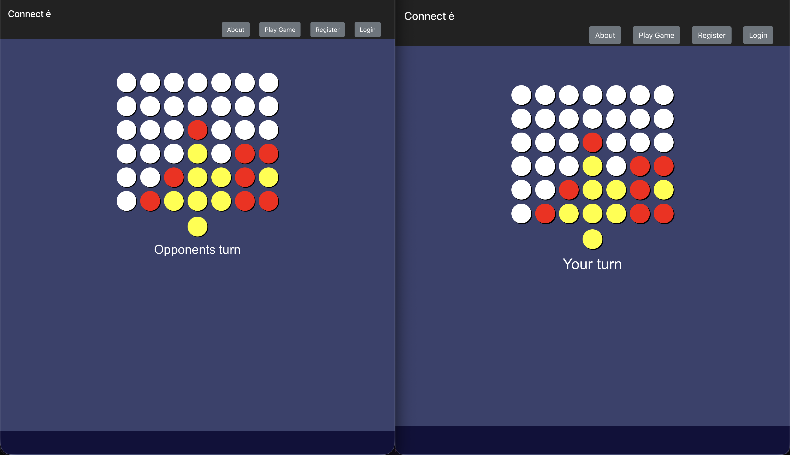
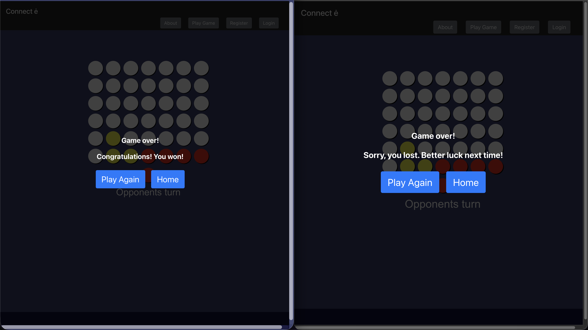
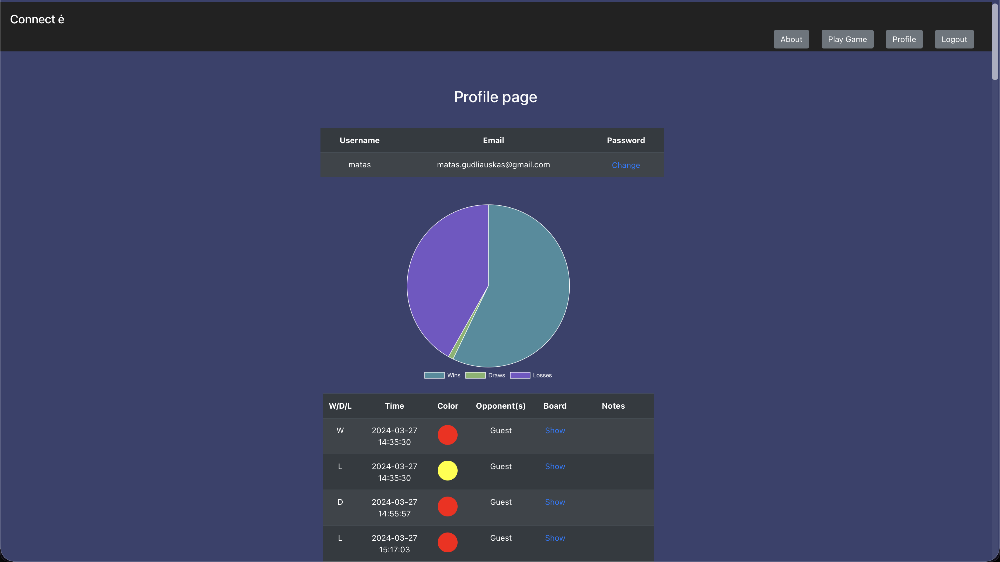
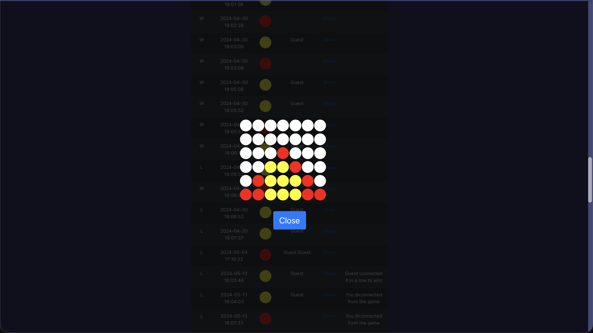
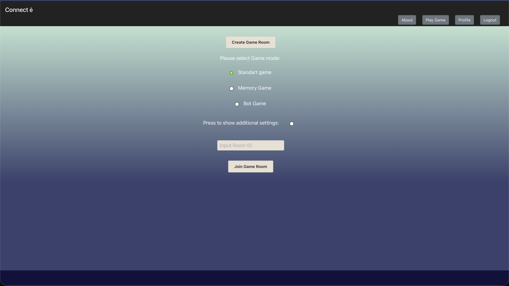

# Connectė
Connectė is an implementation of the game Connect4 using React and Python flask. In the game you can play against other opponents or a bot that utilizes the alpha-beta pruning algorithm to select the moves that lead to the best outcome. The website also implements multiple game modes that would be impossible to play on a physical board.

## Screenshots

## How to run
1. Import `api/DB/Connecte.sql` into a new MySQL database named `Connecte`.

2. Create and activate a Python virtual environment:  
   **macOS / Linux**  
   `python3 -m venv venv`  
   `. venv/bin/activate`  

   **Windows**  
   `py -3 -m venv venv`  
   `venv\Scripts\activate`

3. Install dependencies:  
   **macOS / Linux**  
   `npm run update-mac`  

   **Windows**  
   `npm run update`

4. Start the Flask API:  
   **macOS / Linux**  
   `npm run start-api-mac`  

   **Windows**  
   `npm run start-api`  

   API runs at: `http://localhost:5000`

5. Start the React frontend:  
   `npm start`  

6. Open the app at:  
   `http://localhost:3000`